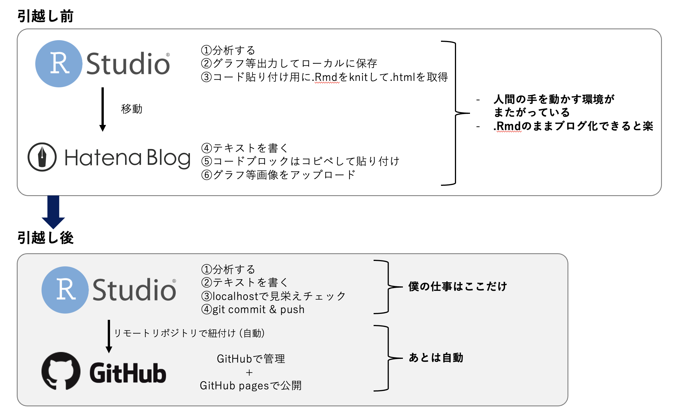

## 引っ越しした理由

NOTE: これは完全に備忘録で、自分の読者像的にマッチしている人はおそらくいません。

<br>

1番の理由は、gitとgithubを勉強している途中でやりたくなったから、です。
そもそも誰かに検索されたい、見知らぬ誰かに届いてほしい、という発想があまりないので、はてなブログだろうと何でも良いというのも関係します。
そもそも公開し始めた理由は、知り合いに共有するときに.Rmdや.htmlだと共有しにくいということが始まりだったので。

僕がこのブログに対して求めるものは次の2点です。

1. RStudioのみを使って分析を含む記事を.Rmdで書きたい。わざわざ、はてなブログに行くのは面倒なので、RStudioで完結してほしい。
2. gitを使ってバージョン管理したい (勉強のため使いたい)

そこで、{blogdown}をRStudioで実行し、RStudio→ github→ github pagesという形で環境を作りました。

執筆環境の前後比較はこんな感じ



## {blogdown}で記事を書いていく

n番煎じなので、特に解説はなしです。ぽんこつ文章読まないマンの僕のした手順だけ書きます。

### 初期設定

githubのSSH設定やRStudioとgithubとの関係等の説明は省略します。

1. githubでレポジトリを作成する。レポジトリを "githubのアカウント名.github.io" にすると、非常に楽。(ルート相対パスの問題が生じるのを回避)
2. レポジトリを作ったら出てくるclone用のリンク (httpsでもsshでもok) をコピーしておく
3. RStudioで New Project > Version Control > Gitと進み、2を貼り付ける
4. new_site()を走らせる (下を参照)。

```{r, eval=FALSE}
# blogdownのインストール
install.packages("blogdown")

# hugoのインストール
library(blogdown)
blogdown::install_hugo()

# 新しいサイトを作る
## themeを指定して、好きなhugoテーマにできる。
new_site(theme = "zhaohuabing/hugo-theme-cleanwhite") 
```

5. new_site() を走らせると、「今見る？」みたいな質問がくるが、nを選択して拒否
6. config.yamlを編集して、publishDir: "docs" を追加する。どこの行でもいけるっぽいが、インデントはなしで。この作業で、gh pagesのdocsから読むことに対応できる ([FYI](https://bookdown.org/yihui/blogdown/rstudio-ide.html#fn13))
7. build_site(), render_site(), 最後にserve_site() と唱えると、webサイトがローカルに立ち上がる。すげえ。
8. ルートディレクトリのconfig.yamlと、config.toml (pathは themes/ (中略) / example/Site/config.toml) を編集して、baseurlを自分のgithub pagesを指定。今回のケースでは、https:// githubのアカウント名 .github.io で良い (see 1)
9. commitして、pushする。
10. githubに移動。レポジトリのsettingに行って、pagesタブへ。
11. "Your GitHub Pages site is currently being built from the /docs folder in the main branch."にする。

これで一旦見れるようになるはず。まずはここをチェックポイントとすると良さげです。
config.yamlあたりは、沼ポイント多めに感じました。いったん動くものを作ってから編集することがおすすめ。(ほんと常識がなさすぎて、いろいろとわからん)

hugoテーマによっては、この時点で走らないものもありました。おそらく自分のせいなんですが、とっとと諦めました。

### 記事の書き方

1. new_post(title = "記事の名前", ext = ".Rmd")<br> Markdownで書くなら拡張子変えればok
2. build_site()
3. render_site()
4. commit & push

buildとrenderを忘れがちなので注意。

写真を入れる場合は、/content/post/日付とタイトル/index_files に写真を入れるのがおすすめ。
パスは ./index_files/hoge.png と、通常のMarkdownの通り書けば、workします。

### 参考にしたもの

参考にしたものは次の記事たち。

* [神記事](https://ytake2.github.io/blog2/post/blogdown/)
* [blogdownの公式?サイト](https://bookdown.org/yihui/blogdown/)
* [同じテーマを使った方のブログ記事](https://blog.johtani.info/blog/2020/01/24/setting-hugo/)
* 自分が選んだhugoテーマのdemoページやgithub。自分のwebサイトが動かないのは「必ず自分側に原因があるはず」という姿勢でやりつつ、適当に諦める。

あとは、とにかくネットサーフィンしてました

## 感想

* はてぶとかのcontents management systems ってやっぱすごいんだなあという感想。編集のやりやすさは圧倒的にはてぶの方が良い。
* とはいえ、Rmdを編集したら自動で記事になるのは結構ありがたい。
* git関連の用語も少しは馴染めたように思う、、、
* (関係ないが) 昔の自分のコードを見ると死ぬほど汚くて悲しい。関数を作るとか、独学だと習わなかったんや...
* 2022/08/05時点で、検索機能をうまく使えていない...この辺javascripitをもう少し理解しないと解けないんだろうか

