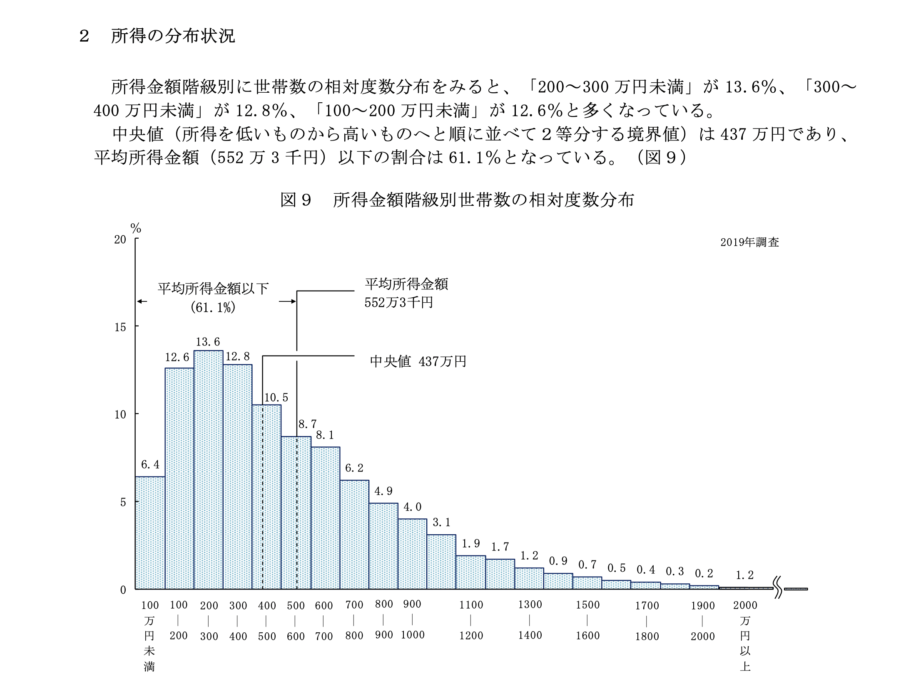

# やること

e-statの令和元年度国民生活基礎調査に基づいて、世帯収入のダミーデータを生む関数を作ります。<br>
source: [e-stat](https://www.e-stat.go.jp/dbview?sid=0003442017)

なお、単身世帯・性別等の個別化された世帯収入ではなく、平均的な日本世帯収入を生むだけです。
個人の世帯収入として扱うのは不十分だと思いますが、データ遊びする分には十分遊べるかと思います。

関数の内容は以下の通りです。

* ID, sex, income (confounder), x (binary exposure), y (binary outcome) を含むデータを作成する 
* incomeは交絡: incomeが少ないほどx and yが発生しやすい (i.e., confounding bias away from the null)
* 引数: n_sample=人数、risk_ratio=曝露によるリスク比

# 関数

## 関数の作成

```{r}
pacman::p_load(tidyverse)
# incomeデータを国民生活基礎調査に基づいて作成
MakeIncomeData <- function(){
  income_cat <- c(1:25)
  min_income <- c(0, 500000, 1000000, 1500000, 2000000, 2500000, 3000000, 3500000, 
                  4000000, 4500000, 5000000, 5500000, 6000000, 6500000, 7000000, 7500000,
                  8000000, 8500000, 9000000, 9500000, 10000000, 11000000, 12000000, 15000000, 20000000)
  max_income <- c(499999, 999999, 1499999, 1999999, 2499999, 2999999, 3499999, 3999999,
                  4499999, 4999999, 5499999, 5999999, 6499999, 6999999, 7499999, 7999999, 8499999,
                  8999999, 9499999, 9999999, 10999999, 11999999, 14999999, 19999999, 100000000)
  
  df_income <- data.frame(income_cat = income_cat,
                          min_income = min_income, 
                          max_income = max_income)
  return(df_income)
}

# ID, sex, income (confounder), x (binary exposure), y (binary outcome) を含むデータを作成する 
# incomeが少ないほどx and yが発生しやすい-> confounding bias away from the null
# 引数: n_sample=人数、risk_ratio=曝露によるリスク比
MakeData <- function(n_sample=1000, risk_ratio=1.5){
  set.seed(1234)
  # income data & income_threshold
  income_cat <- MakeIncomeData()
  income_threshold <- c(0, 0.012, 0.064, 0.127, 0.19, 0.259, 0.326, 0.397, 0.454, 
                        0.51, 0.559, 0.608, 0.646, 0.692, 0.726, 0.759, 0.788,
                        0.814, 0.837, 0.859, 0.878, 0.909, 0.928, 0.966, 0.987, 1)
  
  # make data frame
  df <- data.frame(ID = 1:n_sample)
  df <- df %>% 
    mutate(sex = rbinom(nrow(df), 1, 0.5)) %>% 
    mutate(prob_income = runif(n_sample, min=0, max=1)) %>% 
    mutate(income_cat = cut(prob_income,
                            breaks = income_threshold,
                            right = TRUE, 
                            include.lowest = TRUE,
                            labels = c(1:25)
    )) %>% 
    mutate(income_cat = as.integer(income_cat))
  
  df <- left_join(df, income_cat, by = "income_cat") %>% 
    select(ID, sex, income_cat, min_income, max_income) %>% 
    mutate(income = runif(n_sample, min = min_income, max = max_income)) %>% 
    select(ID, sex, income)
  
  df <- df %>% 
    mutate(income_cat = case_when(
      income < 2500000 ~ "<250",
      income >= 2500000 & income < 4000000 ~ "<400",
      income >= 4000000 & income < 7000000 ~ "<700",
      income >= 7000000 ~ "≥700"
    ),
    income_cat = factor(income_cat, levels = c("<250", "<400", "<700", "≥700"))) 
  
  # 曝露の発生確率と曝露(0/1)を定義
  df <- df %>% 
    mutate(x_prob = case_when(
      income < 2500000 ~ 0.25,
      income >= 2500000 & income < 4000000 ~ 0.2,
      income >= 4000000 & income < 7000000 ~ 0.15,
      income >= 7000000 ~ 0.1
    )) %>% 
    mutate(x = rbinom(nrow(df), 1, x_prob)) # 定めた曝露発生確率の二項分布に従って曝露を決定
  
  # 曝露しているとイベント発生確率がrisk_ratio倍になる
  df <- df %>% 
    mutate(y_prob = case_when(
      income < 2500000 ~ 0.25 * (1 + x*(risk_ratio-1)),
      income >= 2500000 & income < 4000000 ~ 0.2 * (1 + x*(risk_ratio-1)),
      income >= 4000000 & income < 7000000 ~ 0.15 * (1 + x*(risk_ratio-1)),
      income >= 7000000 ~ 0.1 * (1 + x*(risk_ratio-1))
    )) %>% 
    mutate(y = rbinom(nrow(df), 1, y_prob)) %>% 
    select(-x_prob, -y_prob)
  
  return(df)
}
```

## 関数の確認

使い方はこんな感じ

```{r}
df <- MakeData(n_sample = 1000, risk_ratio = 2.0)
head(df)
```

所得の分布はこの通り。200-300万円程度でピークが来ていて、右に長い裾を引くという日本世帯収入の特徴をつかめていると思います。

```{r, message=FALSE, error=FALSE, warning=FALSE}
mean_income <- mean(df$income)
median_income <- median(df$income)

mean_text <- paste0("mean: ", as.character(round((mean_income/1000000), digits=2)), " million yen")
median_text <- paste0("median: ", as.character(round((median_income/1000000), digits=2)), " million yen")

subtitle <- paste0(median_text, " (orange), ", mean_text, " (skyblue)")

ggplot(data = df, aes(x = income)) + 
  geom_histogram() + 
  geom_vline(xintercept = mean_income, linetype = 2, colour = "skyblue") + 
  geom_vline(xintercept = median_income, linetype = 2, colour = "orange") + 
  theme_bw() + 
  xlim(c(0, 20000000)) + 
  ggtitle("simulated distribution of income", subtitle)
```


実際の分布は次のとおりです (source: [URL](https://www.mhlw.go.jp/toukei/saikin/hw/k-tyosa/k-tyosa19/index.html))。



国民生活基礎調査をもとにデータをシミュレーションしているから当然なんだけど、いいデモデータになるでしょ？

一応、xとyとの関連も確認。
単純にxとyをlog-binomialで回帰分析したモデルと、収入を4カテゴリ (250万円未満 / 250-400万円 / 400-700万円 / 700万円以上) に分けて調整したモデルの2つを実行します。

```{r, message=F, warning=FALSE}
crude <- glm(y ~ x, data = df, family = binomial(link = "log"))

summary(crude)
exp(coef(crude)) # risk ratio
```


```{r, message=F, warning=FALSE}
adjusted <- glm(y ~ x + income_cat, data = df, family = binomial(link = "log"))

summary(adjusted)

exp(coef(adjusted)) # risk ratio
exp(confint(adjusted)) # 95%CI
```

```{r, echo=F}
RR_crude <- format(round(exp(coef(crude))[2], digits = 2), nsmall = 2)
RR_adjusted <- format(round(exp(coef(adjusted))[2], digits = 2), nsmall = 2)
```

risk ratioは2.0で設定したところ、データではRR=`r RR_adjusted` になっていました。
おそらく想定した通りにちゃんと動いているでしょう。

また、交絡に関して確認すると、
crudeだと RR=`r RR_crude` で、収入を調整したadjustedだと RR=`r RR_adjusted` となっていました。
したがって、収入がbias away from the nullになっていることも確認できました。

<br>

# 実際に使う場合のtips

実際にこの関数を動かすときは、関数を.Rで作成して保存し、解析コードの.R/.Rmdから読み出すといいでしょう。

例として、以下のディレクトリ構造でコードを書いていたとします。

index.Rmd (← 今書いてるドキュメント) <br>
└ index_files/makedata.R <br>

こういう構造の場合、以下のコードで.Rをソースコードとして読むことが可能です。

```{r}
source("./index_files/makedata.R") # 今回使う自作関数をまとめた.Rファイル
```

そんじゃあね。


