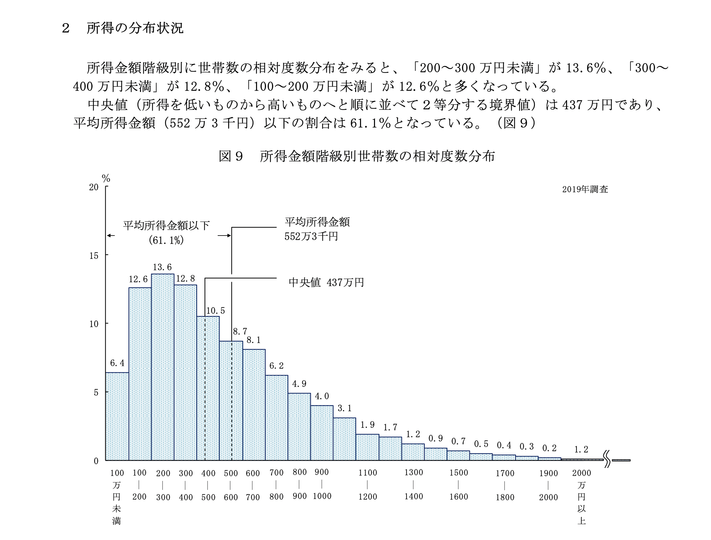

<script type="text/javascript" async src="https://cdnjs.cloudflare.com/ajax/libs/mathjax/2.7.7/MathJax.js?config=TeX-MML-AM_CHTML">
</script>
<script type="text/x-mathjax-config">
 MathJax.Hub.Config({
 tex2jax: {
 inlineMath: [['$', '$'] ],
 displayMath: [ ['$$','$$'], ["\\[","\\]"] ]
 }
 });
</script>

# はじめに

## ほんとのきっかけ

* ネットで男女格差の話が目に止まった 
* 賃金格差で、まーた平均の話してるよ、と思った
* そういやこういう話、大学院でもあったなと思って、ちゃんと言語化してみた

## オープニングトーク

「所得の平均値」や「貯金の平均値」を見てびっくりしたことはありませんか？僕/私の年収・貯金少なすぎ...?と驚くやつです。

まあ、この辺は聞き飽きた方もいるでしょう。 
**所得は偏った（右に裾）分布をしており、平均値の代表性が損なわれている**という話です。
もう少し丁寧に説明すると、一部の高所得者の影響で、平均が引っ張られてしまい、集団の代表値として使いにくくなっているということですね。

実際の分布は次のとおりです (source: [URL](https://www.mhlw.go.jp/toukei/saikin/hw/k-tyosa/k-tyosa19/index.html))。



しかし、単に「代表値としての性質に問題がある」という話では、少し物足りません。
統計ユーザーとしては、「じゃあ、実際に所得を扱うとして、どこに問題があるのか？」を理解したいからです。

平均値に問題があるというのは、統計モデリング・仮説検定等の場面でどこに問題があるのか？
今回は**仮説検定の中でも第1種・第2種の過誤 (type 1 & 2 error) に注目して考察したい**と思います。

# やったこと&結論

## やること

1. 用語の確認
2. そのまま平均値を見る / 対数変換を行う という意味合い
3. type 1 & 2 errorのシミュレーション

## 結論

* 偏った分布に対してそのままt検定を実施しても、type 1 errorに大きな問題はなさそう
* type 2 errorの違いが非常に大きい。検出力を出すために、適切な統計モデリングを行うべき

# 用語の確認

* 第1種の過誤 (type 1 error): 本来差がないのに、「統計的に有意な差がある」と判断する誤りのこと
* 第2種の過誤 (type 2 error): 本来差があるのに、「統計的に有意な差があるとは言えない」と判断する誤りのこと

関連する用語としては、検出力がありますね。検出力はtype2に直結しており、検出力が高ければtype 2 errorは小さくなり、逆も然りです。式で書くなら次の通りですね。

$$power = 1 - \beta$$

(β: type 2 errorの確率)

# そのままの平均値と対数変換

所得のように右に裾を引く分布の場合、データを対数変換することで、分布を正規分布に近づけることができる場合があります。

この言葉だけ聞いてもよくわからないので、実際に確認してみましょう。

## 実演

1000人ほどデータを作成し、分布を確認してみましょう。
[世帯収入の記事](https://toro-maguro.github.io/post/2022-08-07-generateincomedata/)のコードを読み込みます。

```{r, message=FALSE}
pacman::p_load(tidyverse, randomizeR)
source("./index_files/generate_income.R") # 今回使う自作関数をまとめた.Rファイル
```

```{r}
df <- MakeData(n_sample = 1000)
```

関数を先に作っておくことで、データを用意できました。
まずは未処理の収入の分布を確認します。平均値として青線を、中央値として赤線を挿入しています。

```{r, warning=FALSE, message=F}
mean <- mean(df$income)
median <- median(df$income)

hist1 <- ggplot(data = df, aes(x = income)) + 
  geom_histogram() + 
  geom_vline(xintercept = mean, colour = "blue", linetype = 2) + 
  geom_vline(xintercept = median, colour = "red", linetype = 2) + 
  theme_bw() + 
  ggtitle("distribution of annual income (crude)") + 
  xlim(c(0, 20000000))
hist1
```

続いて、対数変換を行った所得分布です。先程同様青は平均値を、赤線は中央値を表します。

```{r, message=F}
df <- df %>% 
  mutate(log_income = log(income))
log_mean <- mean(df$log_income)
log_median <- median(df$log_income)

hist2 <- ggplot(data = df, aes(x = log_income)) + 
  geom_histogram(bins = 50) + 
  geom_vline(xintercept = log_mean, colour = "blue", linetype = 2) + 
  geom_vline(xintercept = log_median, colour = "red", linetype = 2) + 
  theme_bw() + 
  ggtitle("distribution of logged annual income")
hist2 
```

やはり対数変換することで、平均値の集団代表性が高くなることがわかりますね！
けれど、**今回やりたいことは分布とtype 1 & 2 errorの問題です。代表性という主観的な話ではありません。**
「未処理のまま分析してはなぜいけないか」を具体的に捉えていくために、シミュレーションを進めていきましょう。

# シミュレーション

## コード

簡単に説明すると、以下の通りです。

1. 日本の世帯収入をシミュレーションしたデータを作成
2. 2群にランダムに分ける
3. type1の場合、2群の収入に差は (期待値として) ない。type2 (=power) の場合は指定した分差をつける
4. 2群でt検定を実施し、有意な差があるかを確認。そのまま使う場合 or 対数変換する場合の2通りを用意。
5. 1-4を試行回数分実行し、有意になる確率を返す

```{r}
ReturnSignificantProbability <- function(n_sample, iterations = 1000, diff_income = 0, log_transform = FALSE){
  result <- numeric(iterations)
  for (i in 1:iterations) {
    set.seed(i)
    df <- MakeData(n_sample)
    df <- df %>% 
      mutate(group = rbinom(n = nrow(df), size = 1, prob = 0.5)) %>% 
      mutate(income = income + group*diff_income) %>% # group1は指定した分多い
      mutate(log_income = log(income))
    
    groupA <- df %>% filter(group == 0)
    groupB <- df %>% filter(group == 1)
    
    if (log_transform == FALSE){
      ttest_result <- t.test(groupA$income, groupB$income)
    } else if (log_transform == TRUE){
      ttest_result <- t.test(groupA$log_income, groupB$log_income)
    }
    
    result[i] <- if_else(ttest_result[["p.value"]] < 0.05, 1, 0) # 有意であれば1
  }
  return(mean(result))
}
```

## type 1 errorの問題

同じ分布からランダムに所得を発生させ、2グループに分割し、「差がある」と判定される確率を計算しましょう。

同じ分布からデータを生んでいるので、本来差はありません。
**本来差がないはずなのに、偶然差があると判定されること、すなわちtype 1 errorですね！**

人数は両群合計100人から1000人で試しています (片群なら50-500人, 50人ずつチェック)。

```{r}
n <- seq(from=100, to=1000, by=100)
type1_crude_res <- sapply(n, ReturnSignificantProbability,
                          iterations = 1000, 
                          diff_income = 0, # αエラーなのでグループ間のincomeの差を0にする
                          log_transform = FALSE)
type1_log_res <- sapply(n, ReturnSignificantProbability,
                        iterations = 1000, 
                        diff_income = 0,
                        log_transform = TRUE)

d_result <- data.frame(group = c(rep("crude", 10), rep("log", 10)), N = rep(n,2), 
                       type1error = c(type1_crude_res, type1_log_res))
plot1 <- ggplot(data = d_result, aes(x = N, y = type1error, group = group, colour = group)) + 
  geom_line() +
  ylim(c(0, 0.1)) +
  theme_bw() +
  guides(colour = guide_legend(reverse = TRUE))
```

では図を確認しましょう。

横軸は人数 (両群) を表し、縦軸は「有意な差がある」と判断された確率 (=type 1 error) を表します。
そのまま計算しても対数変換しても、人数に依存せず5%付近を推移しており、大きな差は無いように見えます。

この結果を踏まえると、所得のように偏った分布のデータで未処理のまま統計モデリング・仮説検定を行っても、type 1 errorに影響はないと考えられます（要注意: 1つの実験しかしていないので、理論的にどうとかわかってない）


```{r}
plot1
```

type 1 errorに関しては、所得を単純に平均で見ても大きな問題はなさそうですね。
(代表性にはもちろん問題ありますよ)


## type 2 error (検出力, power)

続いて、type 2 error (power) です。

今回は2分割したグループ間に50万円の差を作ります。<br>
一方のグループにのみ、50万円プレゼントしました。

したがって、「本来差があるものを『統計的に差がある』と言えるか？」を扱っていきます。

```{r}
difference_income <- 500000 # グループ間のincomeの差を50万円に

power_crude_res <- sapply(n, ReturnSignificantProbability,
                          iterations = 1000,
                          diff_income = difference_income, 
                          log_transform = FALSE)
power_log_res <- sapply(n, ReturnSignificantProbability,
                        iterations = 1000,
                        diff_income = difference_income,
                        log_transform = TRUE)

d_result <- data.frame(group = c(rep("crude", 10), rep("log", 10)), N = rep(n,2), 
                       power = c(power_crude_res, power_log_res))
plot2 <- ggplot(data = d_result, aes(x = N, y = power, group = group, colour = group)) + 
  geom_line() + 
  theme_bw() + 
  guides(colour = guide_legend(reverse = TRUE))
```


横軸は人数 (両群) を表し、縦軸は「有意な差がある」と判断された確率 (=power) を表します。
先程とは違い、今回は「差がある」というシナリオを考えているので、縦軸が上に行くほど適切と考えます。

**全くもって違う結果に...！！！**

```{r}
plot2
```

人数が増えるほどpowerは増えますが、増え方が全く違いますね！
適切な統計モデリングを行うことで、powerを十分に確保することができます。

<br>

# まとめ

* 偏った分布に対してそのままt検定を実施しても、type 1 errorに大きな問題はなさそう
* type 2 errorが非常に大きい。検出力を出すために、適切な統計モデリングを行うべき

基本的に、検出力は統計モデリングの前提を最も適切に満たした場合に大きくなります。
統計モデリングの前提をより言語化することで、データをよりうまく扱ってあげることに繋がっていきます。


