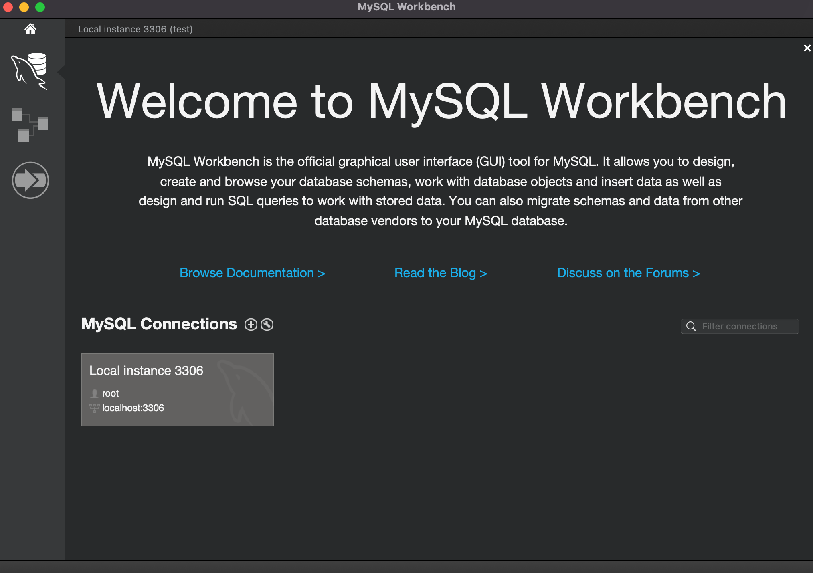

# 内容

SQLの勉強でいろいろ試したいなと思ったけど、RStudio大好き芸人だからRStudioでSQLのQueryを書きたくなった話

* SQLの勉強として練習環境を作りたかった
* RStudioで書きたい (R信者)
* 備忘録です

### 環境

* Intel Mac Mini (2018)
* MySQL 8.0.23
* R version 4.1.2
* RStudio 2022.02.3+492 for macOS

# MySQLをMacに入れる

[Progate](https://prog-8.com/docs/mysql-env)を参考にインストール

ターミナルからMySQLを立ち上げるときは、以下のコードを流せば良い。どっちでも入れる。

* `$ mysql --user=root --password` 
* `$ mysql -u root -p`

### MySQL Workbenchも入れる

参考: [Qiita](https://qiita.com/Hoi-hoi/items/a230f6564614eeddef8c#7-mysql-workbench%E3%82%92%E3%82%A4%E3%83%B3%E3%82%B9%E3%83%88%E3%83%BC%E3%83%AB)

あんまりGUIは使わないかもしれないが一応。なんだかんだ助かる。

# MySQLに練習用のデータベースを入れる

[MySQL公式サイト](https://dev.mysql.com/doc/index-other.html)にも掲載されているemployeeデータをダウンロードします。

1. [GitHub](https://github.com/datacharmer/test_db)から、test_db-master.zipをダウンロードして解凍する
2. ターミナルで解凍したフォルダにcdして、カレントディレクトリにする
3. ターミナルで `$ mysql -u ユーザー名 -p < employee.sql` と唱える

`mysql> show databases;`で、データベースの中にemplyeesが入っているはず。

また`mysql> show tables in employees;`でテーブルを確認すると、以下が返ってくるはず。(もしくは、`mysql> USE employees;`のあとに`mysql> show tables;`)

> +----------------------+
| Tables_in_employees  |
+----------------------+
| current_dept_emp <br>|
| departments <br>     |
| dept_emp<br>         |
| dept_emp_latest_date <br> |
| dept_manager  <br>   |
| employees   <br>     |
| salaries  <br>       |
| titles  <br>         |
+----------------------+
8 rows in set (0.00 sec)

これで、練習用のデータをmysqlに入れることができました。

<br>

# RからMySQLに接続

ここからは、RStudioを操作します。

まずは必要なライブラリをインストールします。今回はMySQLを使うので、{RMySQL}を使います。

```{r}
pacman::p_load(RMySQL) 
```


RからMySQLに接続するコード。ユーザー名やパスワードを直書きするなら、こんな形になります (非推奨)。

```{r}
conn <- dbConnect(
  RMySQL::MySQL(), 
  host = "localhost", # ホスト名
  port = 3306,
  user = "root", # ユーザー名
  password = "password", # パスワード 
  dbname = "employees" # DB名
)
```

「ホスト名やユーザー名ってなんじゃい」って人向けはWorkbenchも見たら良いと思います。

workbenchの画面からLocal instanceを右クリック > Edit Connection から、Hostname, port, usename等々チェックできます。




RとMySQLとの接続でパスワード等をそのまま書き込むのは危険です。
ポップアップ画面で入力する形式を採用するなら、こちら。上述のようなコードに直接書くのはおすすめできません。

```{r, eval=FALSE}
conn <- dbConnect(
  RMySQL::MySQL(), 
  host = "ホスト名",
  port = 3306,
  user = rstudioapi::showPrompt("UserID", "Put your userID"), 
  password = rstudioapi::askForPassword(""), 
  dbname = "db名"
)
```

SSLの暗号化もやったほうがいいです。ただし、ローカル環境で練習する分には、何をどうやっていても問題ないはず。今回は適当にやります。

<br>

さて、今RStudioはMySQLとつながっているので、データを確認できるはずです。employees DBに入っているtablesを確認します。

```{r}
dbListTables(conn)
```

# SQLのqueryを流す

ここまできたら、あとはSQL構文を練習するのみです。まずはdepartmentsというテーブルの頭5行を出してみましょう。クエリを書きます。

```{r}
# SQL風に書けます
firstquery <- "

SELECT * 
FROM departments 
LIMIT 5

"
# 文末のセミコロンはR表記の場合不要です
```

クエリを書いたら、`dbGetQuery()`でRにテーブルを引っ張ってこれます。

```{r}
head_departments <- dbGetQuery(conn, firstquery)
head_departments
```

動きましたね！練習環境としては100点満点じゃないでしょうか。

# おしまい

mysqlをmacに入れて、Rと接続しました。単純にSQLを練習するならIDEに入れなくてもいいけど、どうせならIDEあった方が嬉しいですよね。
RStudio芸人なのでRStudioに入れて遊びました。勉強するぞー。

そんじゃーね！


